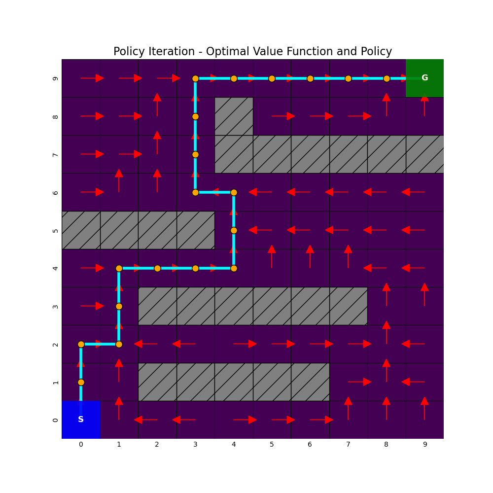

# 🏭 Warehouse Path Planning using MDP

This project implements **Markov Decision Process (MDP)** techniques to optimize robot navigation in a warehouse environment.  
The system uses **Value Iteration** and **Policy Iteration** algorithms to find the most efficient path from the start to the goal while avoiding obstacles.

---

## 🚀 Key Features
- Grid-based warehouse simulation with obstacles.
- Implementation of **Value Iteration** and **Policy Iteration** algorithms.
- Comparison of convergence speed, success rate, and path length.
- Clear visualization of the learned policy and optimal path.

---

## 📊 Algorithm Comparison
| Metric | Value Iteration | Policy Iteration |
|:--|:--:|:--:|
| Iterations/Cycles | 64 | 8 |
| Success Rate | 99.9% | 100% |
| Avg. Path Length | 27.5 | 27.1 |
| Execution Time (s) | 0.07 | 0.80 |

---

## 📸 Visualization
Here’s the visualization of the optimal warehouse path generated using Value Iteration and Policy Iteration:

---

## 🧠 Technologies Used
- Python
- NumPy
- Matplotlib
- Seaborn

---

## 🧩 How It Works
1. The warehouse grid is modeled as a **Markov Decision Process (MDP)**.  
2. Each cell represents a state; the robot chooses an action (Up, Down, Left, Right).  
3. Using **Value Iteration** and **Policy Iteration**, the agent learns the best policy to reach the goal efficiently.  
4. Visualization shows the final learned path and decision arrows.

---

---

## ✨ Author
Developed by **Mohamed Haris**  
[GitHub Profile](https://github.com/<harismb-208>)

